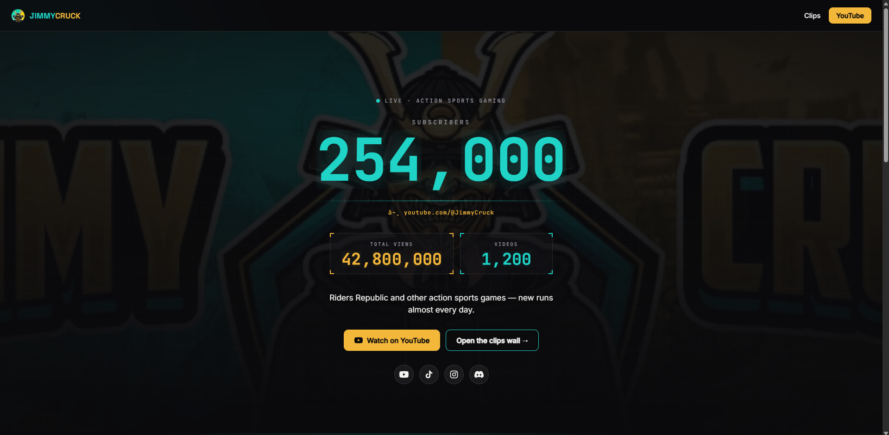
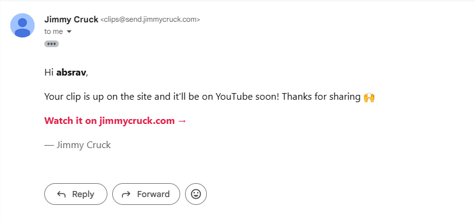
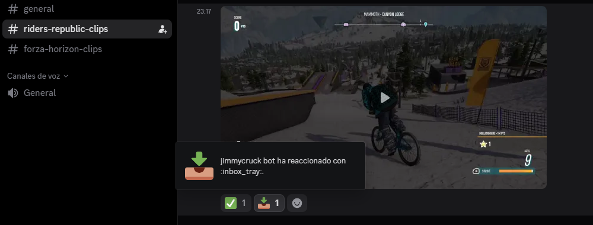

# 🎬 Discord Clip Portal

> A Discord-native clip pipeline and community portal I built end to end, the site, its database, its storage, its login, the bot, all of it. Live in production for **[Jimmy Cruck](https://youtube.com/@JimmyCruck)**, a YouTuber with ~250K subscribers who builds some of his videos from clips his own community sends him. Source kept private.

  

  
    
  

## The problem

For some of his videos, Jimmy builds compilations out of clips his own community sends him in Discord. Getting those clips out was fully manual: scroll the server, open each message, download each video one by one, rename them, sort them by who sent what. Hours per video, before editing even starts. The content was already there. The workflow to collect it was the bottleneck.

I didn't want to hand him a download script. I wanted to build the whole thing, so I did: the site from scratch, its backend, its storage, the login, and the Discord bot that feeds it. The part I'm proud of isn't any single feature. It's that I own every layer end to end. Nothing here is a service I glued together and don't understand.

## What it does

Two sides that share one pipeline.

### For Jimmy: curation without the busywork

He does one thing: **react to a clip in his Discord.** That's the entire workflow. Two reactions, two outcomes:

- **✅ Approve**: the clip goes live on the site *and* gets queued to pull down to disk for the next video.
- **🌐 Web only**: the clip goes live on the site for the community, but stays out of the editing batch.

The moment he reacts, the clip is captured and it's on the web, instantly, no manual downloading. The bot reacts back so he can see at a glance what's been saved. He can change his mind at any time: approving a web-only clip promotes it, marking an approved one as web-only pulls it from the next batch.

Then, when he's ready to edit, **one command pulls every newly-approved clip to a local folder, sorted by creator, filenames intact, ready to drop straight into the timeline.** Only the new ones, never re-downloading, and it never touches the public gallery. What used to be an evening of downloading is now a reaction and a single batch.

### For the community: a reason to come back

The clips don't just disappear into an editor. They live on a **portal where subscribers log in with their Discord account** and browse everything that made the cut, each clip shown with the creator's real Discord avatar and name, grouped by the channel it came from. They can **like** clips and see **view counts**, and pull up **their own submissions** in one place.

And the loop closes with the creators: a fan who's saved their email gets an **automatic email the first time Jimmy picks their clip**, one message if it's live on the site, a different one if it's headed to YouTube. The person who sent the clip finds out it made it, in Jimmy's voice, without Jimmy lifting a finger. The portal also surfaces the channel's latest YouTube uploads, tying the community space back to the videos it feeds.

The reaction that saves a clip for editing is the same signal that surfaces it to everyone, so the workflow that makes Jimmy's videos doubles as a retention engine.

## Built with

Everything runs on free tiers at this scale.

- **The web platform**: built from scratch, deployed from a GitHub repo through **Cloudflare Pages**, with the API layer running as serverless **Pages Functions** at the edge.
- **Neon (Postgres)**: the single source of truth for clips, likes, views, and creator emails.
- **Cloudflare R2**: object storage that serves the video. Zero egress fees, which is the whole reason a video product like this runs cheaply.
- **Discord OAuth2**: subscribers log in with the identity they already use in the community. Built with the boring-but-correct hygiene: CSRF-state protection, signed sessions, minimal `identify` scope, no passwords to store.
- **Resend**: the transactional emails to creators.
- **The bot**: Node.js + discord.js. Owner-only reactions count, and it streams uploads straight through, so a 5 MB clip and a 500 MB clip are handled the same way.

## Why there's no source here (and no wiring diagram)

Two reasons, and I'd rather be upfront about both.

One: this is a live system running for a real creator's community, holding real user data and credentials. That code doesn't belong in public.

Two: I'm deliberately not spelling out how the pieces connect. Not because it's a secret nobody could reverse-engineer, but because I know this pipeline end to end and can stand it up again, tailored, for a different creator. If that's something you want, it's a conversation worth having, not a diagram worth copying. You can see it running for real: the [site](https://jimmycruck.com/), the [portal](https://jimmycruck.com/clips), and the [Discord](https://discord.com/invite/zcAenGZ46G) where the bot lives. Reach me at the bottom.

## Honest limitations

Same as every repo of mine: here's what I'd flag reviewing this critically.

- **The bot is operator-run, not always-on.** Jimmy starts it and reacts; capture happens while it's running. Fine for how he works, but it means the pipeline depends on the process being up rather than sitting hosted 24/7.
- **Moderation is Jimmy's reaction, and nothing more.** A human decides what enters, which is a cheap and decent gate, but there's no automated check and no report path for portal users. For fan-submitted video that's a real content and copyright surface I'd want to harden before this served anyone but one trusted community.
- **Single-tenant.** Built for one creator. Branding and config are baked in rather than per-tenant.
- **Free-tier economics don't generalize.** They cover one creator at this volume comfortably. Storage and operations grow with the clip library, and a multi-creator version would leave those tiers quickly.

## What I'd do differently today

- Host the bot as an always-on worker so a reaction is captured whether or not I'm running anything.
- Design it multi-tenant from day one if it were ever going to be a product, instead of retrofitting it.
- Add a proper moderation and report flow on the portal side.
- Formalize the boundaries between the moving parts so any one of them can change without touching the others.

## AI assistance

Parts of this project and this write-up were built with AI assistance, disclosed here as in all my repos.

---

<em>If you run a community and this is the kind of thing you wish you had, or you just want to talk shop about how it's built, reach out.</em>

  

<a href="mailto:absravdev@gmail.com">📧 absravdev@gmail.com</a> · <a href="https://abstractraven.com/">🌐 abstractraven.com</a> · 🐦‍⬛ <a href="https://github.com/absravdev">AbstractRaven</a>

